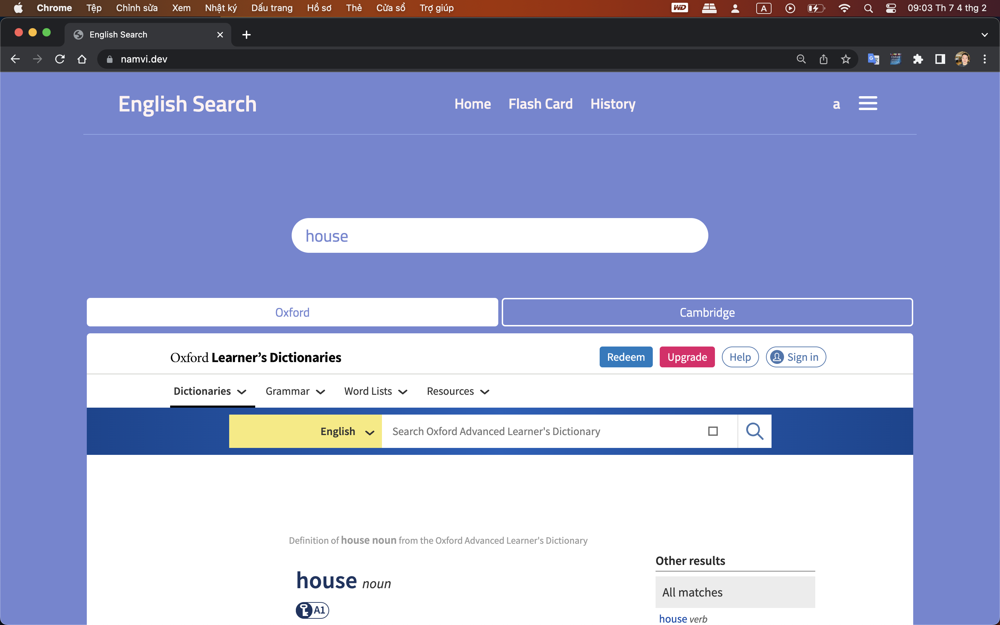

<p align="center" width="100%">
     
</p>

# English Search Web:

<p align="center" width="100%">
     
</p>

# How to run:

```
node main.js
```

# Features:
* Search English word and show result on 3 website: Oxford, Cambrigde, Google Translate (work on IOS)
* Flash Card
* Save your history seached word

# JavaScript runtime environment:
* Nodejs
  
# Libraries:
* Jquery
* axios@1.2.1
* boostrap

# Data English word from:
* 446k words: https://github.com/dwyl/english-words
* 10k google words: https://github.com/first20hours/google-10000-english

# This App have 3 versions on 3 devices:
* [IOS app](https://github.com/vitiennam/EngS)
* [Android app](https://github.com/vitiennam/EngSAndroid)
* [Website](https://github.com/vitiennam/EngSWeb)